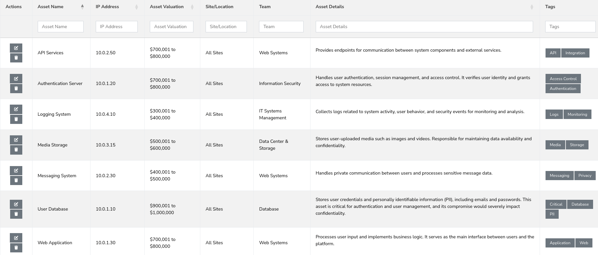
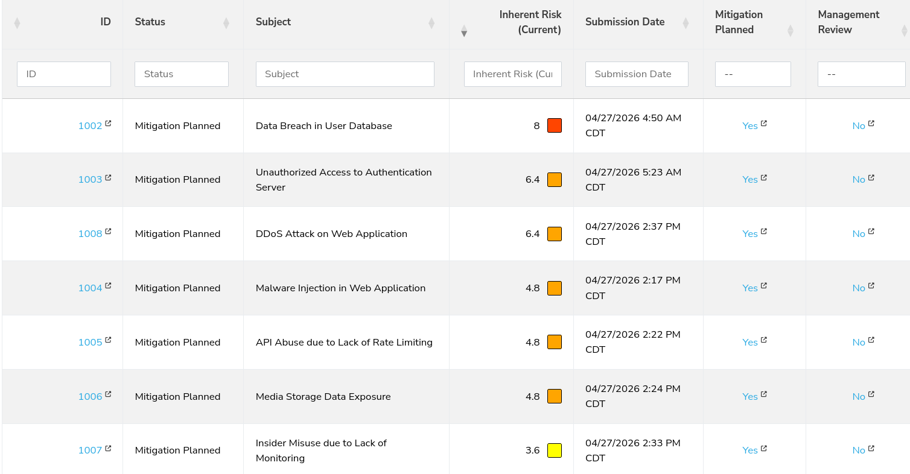
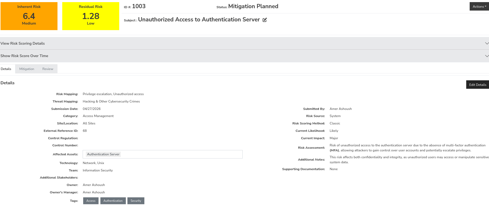
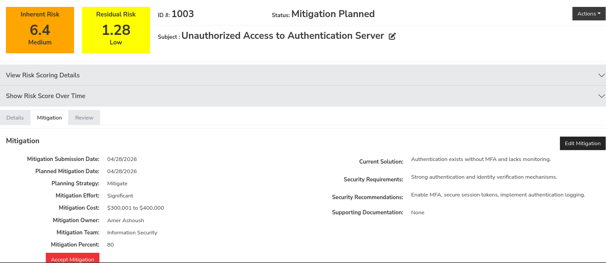
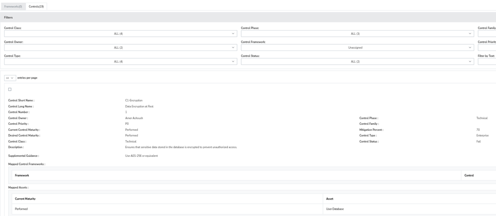
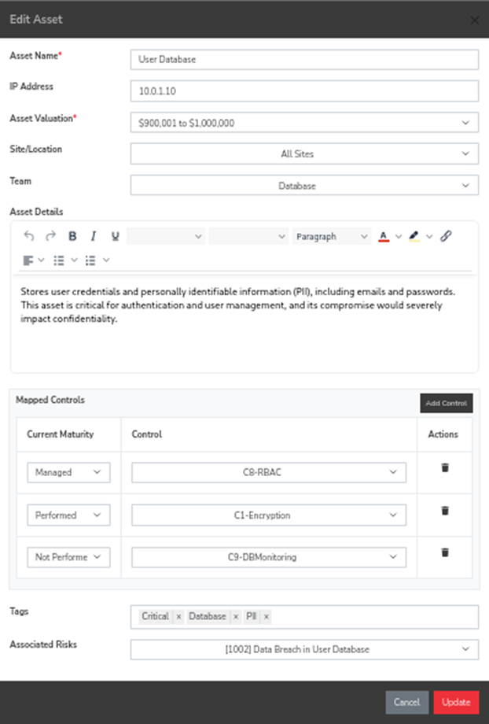
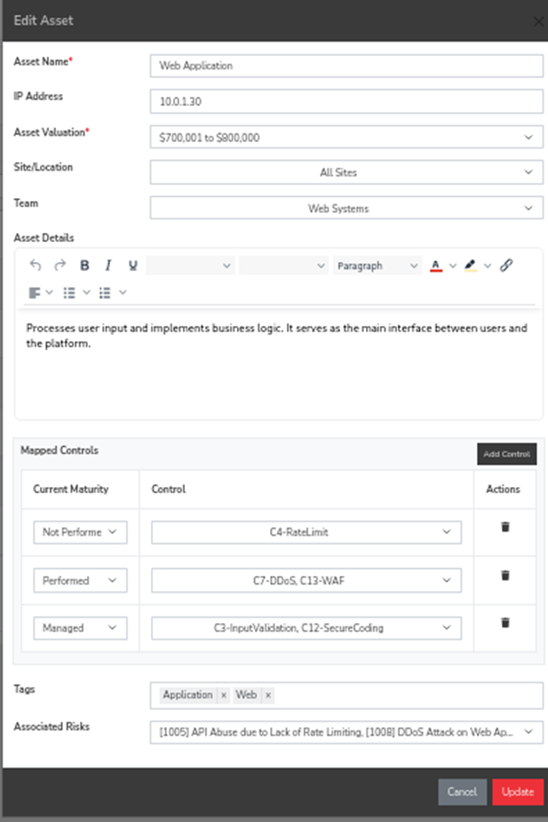

# Cybersecurity Risk Assessment of a Social Media Platform

## 📌 Overview

This project presents a structured cybersecurity risk assessment for a social media platform based on the NIST SP 800-30 framework.

The objective is to identify, analyze, and mitigate risks affecting system confidentiality, integrity, and availability.

---

## 🧠 Methodology

The project follows a complete risk management lifecycle:

1. Asset Identification
2. Threat Identification
3. Vulnerability Identification
4. Risk Identification
5. Risk Analysis (Likelihood × Impact)
6. Risk Evaluation
7. Risk Treatment
8. Control Implementation

---

## 🏗️ System Description

The analyzed system is a social media platform supporting:

* User authentication
* Content sharing (posts, images, videos)
* Messaging and interaction
* Data storage and analytics

---

## 🔐 Identified Assets

* User Database
* Authentication Server
* Web Application
* Media Storage
* Messaging System
* Logging System
* API Services

---

## ⚠️ Key Risks

| Risk | Description                  |
| ---- | ---------------------------- |
| R1   | Data Breach in User Database |
| R2   | Unauthorized Access          |
| R3   | Malware Injection            |
| R4   | API Abuse                    |
| R5   | Media Data Exposure          |
| R6   | Insider Misuse               |
| R7   | DDoS Attack                  |

---

## 📊 Risk Analysis

### Asset Identification



### Risk Register



### Risk Scoring



---

## 🛡️ Risk Treatment



| Risk | Treatment                              |
| ---- | -------------------------------------- |
| R1   | Mitigate (Encryption + Access Control) |
| R2   | Mitigate (MFA)                         |
| R3   | Mitigate (Input Validation)            |
| R4   | Mitigate (Rate Limiting)               |
| R5   | Mitigate (Secure Configurations)       |
| R6   | Accept (Monitoring)                    |
| R7   | Transfer (Cloud DDoS Protection)       |

---

## 🔧 Control Implementation



Implemented controls include:

* Data Encryption
* Multi-Factor Authentication (MFA)
* Role-Based Access Control (RBAC)
* Input Validation
* Web Application Firewall (WAF)
* Rate Limiting
* Logging & Monitoring
* SIEM Integration

---

## 🔗 Asset-Control Mapping

### User Database Mapping



### Web Application Mapping



---

## 🧱 Security Approach

The project applies a layered security model:

* Identity & Access → MFA, RBAC
* Application → Input Validation, WAF
* Data → Encryption
* Monitoring → Logging, SIEM
* Perimeter → DDoS Protection

---

## 🛠️ Tools Used

* SimpleRisk
* LaTeX

---

## 📂 Repository Structure

```
├── report/
├── screenshots/
└── README.md
```

---

## 🎯 Key Takeaways

* Structured risk management improves system security
* Mapping risks to controls ensures proper mitigation
* Layered defense strengthens resilience

---

## 👨‍💻 Authors

* Amer Ashoush

---

## 📜 License

This project is for academic purposes.
